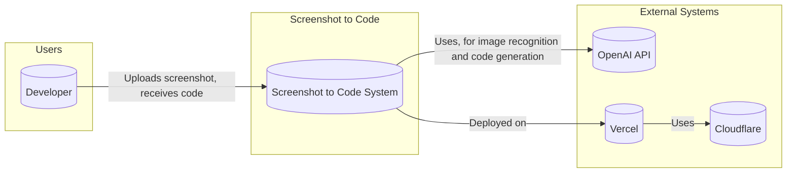
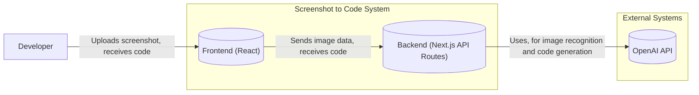
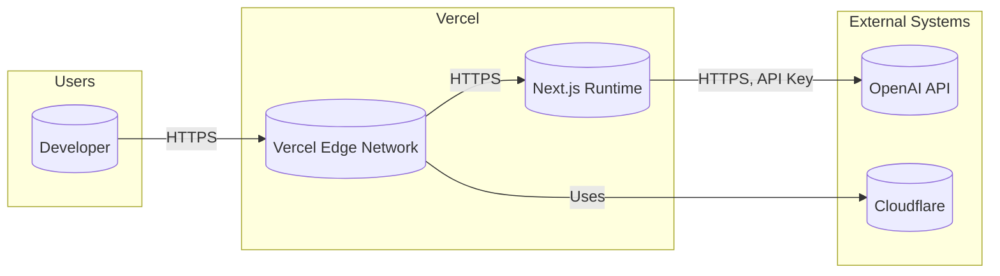
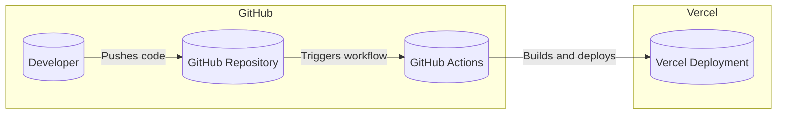

Okay, let's create a detailed design document for the `screenshot-to-code` project, focusing on aspects relevant to threat modeling.

# BUSINESS POSTURE

Business Priorities and Goals:

*   Rapid Prototyping:  Enable developers and designers to quickly translate visual designs (screenshots) into functional code (HTML/Tailwind CSS, potentially other frameworks).
*   Increased Efficiency: Reduce the time and effort spent on manually writing boilerplate code for UI layouts.
*   Accessibility: Potentially generate more accessible code by incorporating best practices (though this is dependent on the model's training and implementation).
*   Ease of Use: Provide a simple and intuitive user interface for uploading screenshots and receiving generated code.
*   Iterative Development: Allow users to refine the generated code by providing feedback or making manual adjustments.

Most Important Business Risks:

*   Inaccurate Code Generation: The model may produce incorrect, inefficient, or semantically meaningless code, requiring significant manual correction. This impacts productivity and user trust.
*   Security Vulnerabilities in Generated Code: The generated code might contain vulnerabilities (e.g., XSS, CSRF, if JavaScript is involved), especially if the model isn't trained on secure coding practices or if user-provided configurations are mishandled.
*   Intellectual Property Concerns:  Users may be concerned about uploading proprietary designs to a third-party service.  The service needs to assure users about data privacy and security.  Conversely, the service needs to protect its own IP (the model itself).
*   Scalability and Reliability: The service needs to handle a potentially large number of concurrent users and image processing requests without significant performance degradation or downtime.
*   Dependency Risks: Reliance on external services (e.g., OpenAI API) introduces a dependency risk.  If the external service is unavailable or changes its pricing/terms, it could impact the project.
*   Abuse Potential:  Malicious users might attempt to use the service for unintended purposes, such as generating phishing pages or other malicious content.

# SECURITY POSTURE

Existing Security Controls (Based on the GitHub repository and common practices):

*   security control: Input Validation (Likely): The frontend and backend likely perform some basic input validation to ensure the uploaded file is an image and has a reasonable size. (Inferred from `App.tsx` and general good practice).
*   security control: API Authentication (Likely): If interacting with the OpenAI API, API keys are used for authentication and authorization. (Inferred from general OpenAI API usage).
*   security control: Rate Limiting (Potentially): There might be rate limiting in place to prevent abuse and manage resource consumption. (Not explicitly mentioned, but a common practice).
*   security control: HTTPS (Likely): The application is likely served over HTTPS to encrypt communication between the client and server. (Inferred from deployment on Vercel and general best practice).

Accepted Risks:

*   accepted risk: Model Hallucinations: The model may generate code that is syntactically correct but semantically incorrect or nonsensical. This is an inherent limitation of current AI models.
*   accepted risk: Limited Security Guarantees in Generated Code:  The generated code is not guaranteed to be free of security vulnerabilities. Users are expected to review and validate the code before deploying it to production.
*   accepted risk: Dependency on OpenAI API: The project's functionality is dependent on the availability and terms of service of the OpenAI API.

Recommended Security Controls:

*   security control:  Content Security Policy (CSP): Implement a strict CSP to mitigate XSS risks, especially if user-provided configurations or dynamic code execution are involved.
*   security control:  Input Sanitization:  In addition to basic image validation, sanitize any user-provided text inputs (e.g., configuration options) to prevent injection attacks.
*   security control:  Output Encoding:  Encode any user-provided data that is displayed in the UI to prevent XSS.
*   security control:  Dependency Scanning: Regularly scan project dependencies for known vulnerabilities.
*   security control:  Security Training for Developers: Ensure developers are aware of secure coding practices and common web vulnerabilities.
*   security control:  Regular Security Audits: Conduct periodic security audits and penetration testing to identify and address potential vulnerabilities.
*   security control:  Monitoring and Alerting: Implement monitoring and alerting to detect and respond to suspicious activity.
*   security control:  Data Encryption at Rest: If storing user-uploaded images or generated code, encrypt the data at rest.

Security Requirements:

*   Authentication:
    *   If user accounts are implemented, use a strong password hashing algorithm (e.g., bcrypt, Argon2).
    *   Consider implementing multi-factor authentication (MFA) for enhanced security.
    *   Implement secure session management, including secure cookies and session timeouts.

*   Authorization:
    *   If user roles are implemented, enforce the principle of least privilege.
    *   Ensure that users can only access their own data and resources.

*   Input Validation:
    *   Validate all user inputs on the server-side, including image file types, sizes, and dimensions.
    *   Sanitize any user-provided text inputs to prevent injection attacks.

*   Cryptography:
    *   Use HTTPS for all communication between the client and server.
    *   Store API keys securely (e.g., using environment variables or a secrets management service).
    *   If storing sensitive user data, encrypt it at rest.
    *    Use up-to-date libraries.

*   Secure configuration:
    *   Use secure defaults for all configurable options. Do not rely on secret in URL.

# DESIGN

## C4 CONTEXT

Element Descriptions:

*   Element:
    *   Name: Developer
    *   Type: User
    *   Description: A software developer or designer who uses the Screenshot to Code service.
    *   Responsibilities: Uploads screenshots, receives generated code, and provides feedback.
    *   Security Controls: None (External to the system).

*   Element:
    *   Name: Screenshot to Code System
    *   Type: System
    *   Description: The main application that processes screenshots and generates code.
    *   Responsibilities: Handles user input, interacts with the OpenAI API, and returns generated code.
    *   Security Controls: Input validation, API authentication, rate limiting (potential), HTTPS.

*   Element:
    *   Name: OpenAI API
    *   Type: External System
    *   Description: The OpenAI API, used for image recognition and code generation.
    *   Responsibilities: Provides the core AI functionality for the project.
    *   Security Controls: API authentication, rate limiting (managed by OpenAI).

*   Element:
    *   Name: Vercel
    *   Type: External System
    *   Description: Vercel is platform as a service provider.
    *   Responsibilities: Provides hosting.
    *   Security Controls: HTTPS, DDoS protection, WAF.

*   Element:
    *   Name: Cloudflare
    *   Type: External System
    *   Description: Cloudflare is CDN and DNS provider.
    *   Responsibilities: Provides DNS records, and CDN.
    *   Security Controls: HTTPS, DDoS protection, WAF.

## C4 CONTAINER

Element Descriptions:

*   Element:
    *   Name: Frontend (React)
    *   Type: Container (Web Application)
    *   Description: The user interface, built with React, that allows users to upload screenshots and view generated code.
    *   Responsibilities: Handles user interaction, displays the UI, and communicates with the backend.
    *   Security Controls: Input validation (basic), HTTPS.

*   Element:
    *   Name: Backend (Next.js API Routes)
    *   Type: Container (API)
    *   Description: The server-side logic, implemented using Next.js API routes, that handles image processing and communication with the OpenAI API.
    *   Responsibilities: Receives image data from the frontend, interacts with the OpenAI API, and returns generated code.
    *   Security Controls: Input validation, API authentication, rate limiting (potential).

*   Element:
    *   Name: OpenAI API
    *   Type: External System
    *   Description: The OpenAI API, used for image recognition and code generation.
    *   Responsibilities: Provides the core AI functionality for the project.
    *   Security Controls: API authentication, rate limiting (managed by OpenAI).

## DEPLOYMENT
Possible deployment solutions:
1.  Vercel: Project is already prepared to be deployed to Vercel.
2.  AWS: Project can be deployed to AWS using Amplify, or combination of S3, CloudFront and API Gateway.
3.  Azure: Project can be deployed to Azure using Static Web Apps.
4.  GCP: Project can be deployed to GCP using Cloud Run.

Chosen solution: Vercel

Element Descriptions:

*  Element:
    *   Name: Developer
    *   Type: User
    *   Description: A software developer or designer who uses the Screenshot to Code service.
    *   Responsibilities: Uploads screenshots, receives generated code, and provides feedback.
    *   Security Controls: None (External to the system).

*   Element:
    *   Name: Vercel Edge Network
    *   Type: Infrastructure Node (CDN)
    *   Description: Vercel's edge network, which serves the application's static assets and handles incoming requests.
    *   Responsibilities: Caching, routing, and serving static content.
    *   Security Controls: HTTPS, DDoS protection, WAF.

*   Element:
    *   Name: Next.js Runtime
    *   Type: Runtime Environment
    *   Description: The Next.js runtime environment, which executes the application's server-side code.
    *   Responsibilities: Handling API requests, interacting with the OpenAI API, and rendering server-side components.
    *   Security Controls: Input validation, API authentication, rate limiting (potential).

*   Element:
    *   Name: OpenAI API
    *   Type: External System
    *   Description: The OpenAI API, used for image recognition and code generation.
    *   Responsibilities: Provides the core AI functionality for the project.
    *   Security Controls: API authentication, rate limiting (managed by OpenAI).

*   Element:
    *   Name: Cloudflare
    *   Type: External System
    *   Description: Cloudflare is CDN and DNS provider.
    *   Responsibilities: Provides DNS records, and CDN.
    *   Security Controls: HTTPS, DDoS protection, WAF.
## BUILD

Build Process Description:

1.  Developer pushes code changes to the GitHub repository.
2.  GitHub Actions is triggered by the push event.
3.  GitHub Actions workflow executes, performing the following steps:
    *   Checks out the code from the repository.
    *   Installs project dependencies (using `npm install` or `yarn install`).
    *   Runs linters and formatters (e.g., ESLint, Prettier) to enforce code style and identify potential issues.
    *  Runs unit test.
    *   Builds the application (using `npm run build` or `yarn build`).
    *   Deploys the application to Vercel (using the Vercel CLI or a GitHub Action for Vercel deployments).

Security Controls:

*   security control: Dependency Management: The project uses `package.json` and `package-lock.json` (or `yarn.lock`) to manage dependencies, ensuring consistent builds and reducing the risk of introducing vulnerable dependencies.
*   security control: Linting and Formatting: Linters and formatters (e.g., ESLint, Prettier) are used to enforce code style and identify potential code quality issues.
*   security control: Automated Build: GitHub Actions provides an automated build process, ensuring that the application is built consistently and reproducibly.
*   security control: Vercel Deployment Security: Vercel provides built-in security features, such as HTTPS and DDoS protection.
*   security control: Secrets Management: Vercel and Github Actions provide secrets management.

# RISK ASSESSMENT

Critical Business Processes:

*   Code Generation: The core process of converting screenshots into code is critical. Its accuracy, speed, and reliability directly impact the value proposition of the service.
*   User Interaction: The process of users uploading screenshots, configuring options (if any), and receiving/reviewing generated code must be smooth and intuitive.
*   API Integration: The interaction with the OpenAI API is critical, as it provides the underlying AI capabilities.

Data and Sensitivity:

*   Uploaded Screenshots (Potentially Sensitive): Screenshots may contain proprietary designs, confidential information, or personal data. Sensitivity depends on the user and the content of the screenshot.  Classify as *Confidential* at minimum.
*   Generated Code (Potentially Sensitive): The generated code itself may not be inherently sensitive, but it could become sensitive if it incorporates elements from a sensitive screenshot. Classify as *Confidential* at minimum.
*   User Configuration (Potentially Sensitive):  If users can provide configurations or settings, these might contain sensitive information (e.g., API keys for other services). Classify as *Confidential*, or *Secret* if it contains credentials.
*   API Keys (Highly Sensitive): The OpenAI API key is highly sensitive and must be protected from unauthorized access. Classify as *Secret*.

# QUESTIONS & ASSUMPTIONS

Questions:

*   What is the expected volume of users and requests? This will impact scalability requirements.
*   Are there any specific compliance requirements (e.g., GDPR, HIPAA) that need to be considered?
*   What level of accuracy is required for the generated code?  What is the tolerance for errors?
*   Will users be able to provide feedback on the generated code?  If so, how will this feedback be used?
*   Are there any plans to support other frameworks or languages beyond HTML/Tailwind CSS?
*   What is acceptable downtime?
*   What is the budget for security measures?

Assumptions:

*   BUSINESS POSTURE: The primary goal is rapid prototyping, and users are aware that the generated code may require manual review and adjustments.
*   SECURITY POSTURE: Users are responsible for reviewing and securing the generated code before deploying it to production. The service does not guarantee the security of the generated code.
*   DESIGN: The OpenAI API is a critical dependency, and its availability and performance will impact the overall service.
*   DESIGN: Vercel is selected as a deployment platform.
*   DESIGN: Project is using GitHub Actions for build automation.
