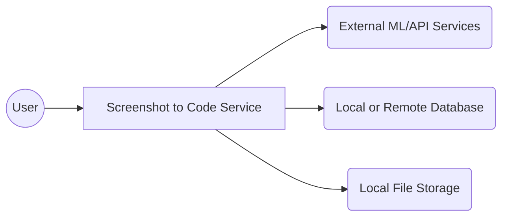
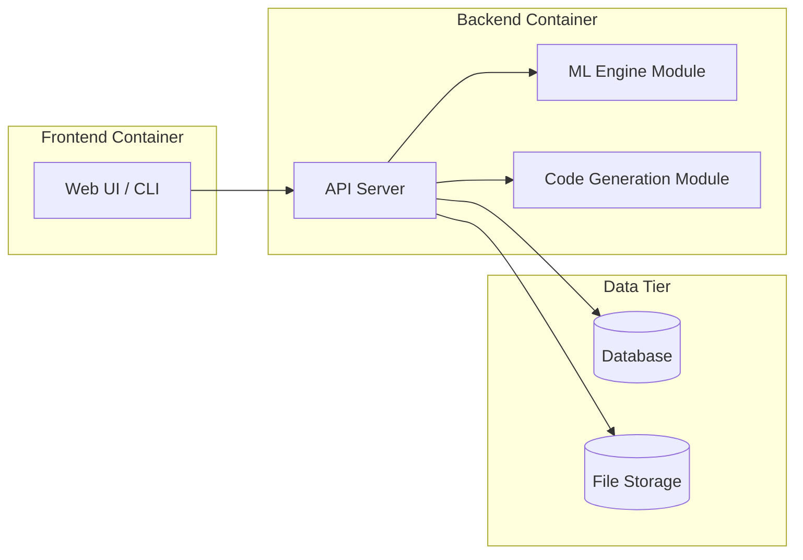
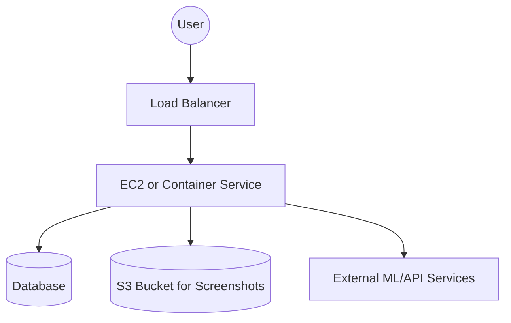
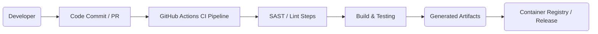

# BUSINESS POSTURE
The primary objective of the screenshot-to-code project is to enable automated transformation of UI screenshots into code, thereby accelerating the development process and reducing manual coding effort. This can be beneficial for rapid prototyping, UI mock-up validation, and generating boilerplate code. The main business goals are to decrease time-to-market, reduce development costs, and increase developer productivity. The project can be integrated into existing toolchains or used as a standalone service.

Key business risks:
1. Risk of poor or inconsistent code output leading to decreased user satisfaction and reduced adoption.
2. Risk of intellectual property misuse if screenshots contain proprietary UI designs.
3. Risk of limited monetization options or unclear revenue model, depending on how the project is commercialized.
4. Risk of project stagnation if there is insufficient community or organizational support to maintain and improve the technology.

# SECURITY POSTURE
Existing security controls:
- security control (Basic Access) – The GitHub repository is publicly available, with read access by default. Code commits can be reviewed via GitHub pull requests.
- security control (Code Scanning) – GitHub native code scans can be enabled (if configured) to identify vulnerabilities in the codebase.
- security control (ML Model Isolation) – The project can run inference locally or in a container, limiting direct exposure of underlying infrastructure.
- security control (Adherence to Open Source Best Practices) – Basic best practices like storing dependencies in a requirements file and referencing official frameworks.

Accepted risks:
- accepted risk (Data Privacy) – Screenshots uploaded to the service can contain sensitive design or user interface data. Processing this data might be accepted as a necessary function of the project.
- accepted risk (Model Accuracy) – The risk that the generated code may not be fully accurate or secure upon inference is accepted based on the experimental nature of the project.

Recommended security controls (high priority to implement):
- Implement secure authentication and authorization mechanisms if the service is exposed publicly.
- Integrate automated security testing tools (SAST, DAST) in the CI/CD pipeline.
- Employ secure logging and monitoring solutions to detect anomalies during screenshot uploads and code generation processes.
- Implement robust data handling and secure storage for screenshots, particularly if the service is hosted on a public cloud.

Security requirements:
1. Authentication: Ensure only authorized users or services can access the screenshot-to-code API or UI.
2. Authorization: Enforce access controls to limit resource usage to legitimate roles (e.g., developers, admins).
3. Input Validation: Validate input images for correct file type and size limits to stave off malicious files or attacks.
4. Cryptography: Use encryption-in-transit (HTTPS) and consider encrypting stored screenshots or model artifacts at rest.

# DESIGN

## C4 CONTEXT

### Context Diagram

### Context Diagram Elements

| Name                | Type       | Description                                                                 | Responsibilities                                                            | Security controls                                                                       |
|---------------------|-----------|-----------------------------------------------------------------------------|----------------------------------------------------------------------------|------------------------------------------------------------------------------------------|
| User                | Person     | An individual or application that wants to convert UI screenshots into code | Provides screenshots and receives generated code                            | security control (Access control via authentication)                                     |
| Screenshot to Code Service | System     | Core system that receives screenshots, processes them, and returns code     | Accept screenshot inputs, run inference, generate code, and return results | security control (Hardening, logging)                                                    |
| External ML/API Services  | External    | External AI/ML frameworks or APIs used to enhance or offload processing     | Perform specialized image recognition, OCR, or advanced inference           | security control (Secure connection, API key rotation), accepted risk (Third-party trust) |
| Local or Remote Database  | Data Store | Storage for logs, user data, or usage statistics                             | Saves historical data, analytics, or user results                           | security control (Encrypted at rest, restricted access)                                  |
| Local File Storage        | Data Store | Local or cloud-based file storage for temporary screenshot blobs            | Holds uploaded images during processing                                     | security control (Encryption at rest, secure file handling)                              |

## C4 CONTAINER

### Container Diagram

### Container Diagram Elements

| Name                   | Type       | Description                                                           | Responsibilities                                                          | Security controls                                                                                             |
|------------------------|-----------|-----------------------------------------------------------------------|----------------------------------------------------------------------------|----------------------------------------------------------------------------------------------------------------|
| Web UI / CLI           | Container | Represents either a web-based front-end or a CLI tool                 | Allows users to upload screenshots and view/download generated code        | security control (Secure input validation, restricted access)                                                 |
| API Server             | Container | The main interface handling user requests and coordinating processes  | Validates input, orchestrates ML inference, invokes code generation        | security control (TLS, authentication, authorization, request throttling)                                     |
| ML Engine Module       | Container | Performs image processing and layout recognition using machine learning | Extracts UI components, converts graphic data to structured representation | security control (Isolated runtime environment, controlled resource access)                                   |
| Code Generation Module | Container | Converts the extracted component data into code (HTML/CSS, etc.)      | Maps recognized layout information to appropriate code templates           | security control (Secure library usage, code scanning)                                                        |
| Database               | Container | Stores persistent data (e.g., user info, results, logs)               | Maintains state regarding user sessions, usage metrics, and generated code | security control (Encrypted at rest, access control, audit logging)                                           |
| File Storage           | Container | Stores user-uploaded screenshots                                      | Retains image data needed for processing                                  | security control (Access control, encryption, secure deletion)                                                |

## DEPLOYMENT

Possible deployment options:
1. Cloud deployment on AWS or similar (using Docker containers on ECS or Kubernetes, S3 for file storage, RDS for database).
2. On-premises deployment using self-managed servers and container orchestration tools.
3. Hybrid approach where sensitive data is processed on-premises and external ML APIs are used in the cloud.

Chosen deployment model example (fully in the cloud):

### Deployment Diagram Elements

| Name                             | Type              | Description                                                                  | Responsibilities                                                  | Security controls                                                                               |
|----------------------------------|-------------------|------------------------------------------------------------------------------|------------------------------------------------------------------|--------------------------------------------------------------------------------------------------|
| User                             | Entity            | The end user accessing the system through a network connection               | Initiates screenshot uploads and receives code results            | security control (Firewall, network access rules)                                               |
| Load Balancer                    | Network Component | Distributes incoming requests across multiple service instances              | Enables horizontal scaling and high availability                  | security control (HTTPS termination, WAF integration)                                           |
| EC2 or Container Service         | Compute Resource  | Hosts the API server, ML engine, and code generation components in containers | Processes requests, orchestrates ML calls, and returns responses  | security control (IAM roles, limited inbound/outbound traffic, OS/Container hardening)          |
| Database                         | Data Store        | A managed database service (e.g., RDS)                                        | Stores persistent data                                            | security control (Encryption at rest, restricted security groups)                               |
| S3 Bucket for Screenshots        | Object Storage    | Stores uploaded screenshots in isolated buckets                               | Retains images, allows restricted read/write operations           | security control (Access policies, encryption at rest, logging)                                 |
| External ML/API Services         | External Service  | Third-party AI or ML frameworks APIs                                         | Provides specialized operations (OCR, advanced recognition)        | security control (API keys, secure communications)                                              |

## BUILD

Below is an example of how a typical build process might look using GitHub Actions. It may vary based on project requirements:

1. A developer commits code or opens a pull request in GitHub.
2. GitHub Actions pipeline is triggered, running static analysis (SAST), security linters, and unit tests.
3. If tests pass, the code is built, and final artifacts (e.g., container images, package distributions) are generated.
4. Artifacts are stored or published to a container registry or release repository, ready for deployment.

Security controls in the build:
- Automated SAST scanning to identify potential coding flaws or vulnerabilities.
- Security linting to catch misconfigurations in Dockerfiles, YAML definitions, or environment variables.
- Dependencies scanning to detect known CVEs in third-party libraries.
- Signed artifacts to ensure integrity during the release process.

# RISK ASSESSMENT
What are critical business processes we are trying to protect?
- The automation of converting screenshots into functioning code.
- Timely and reliable code generation to maintain user trust and adoption.
- Protection of proprietary or sensitive UI designs contained within screenshots.

What data are we trying to protect and what is their sensitivity?
- User-supplied screenshots that may contain proprietary UI designs or sensitive corporate branding.
- Generated code artifacts that could contain business logic.
- Access credentials for external ML services or private repositories.

# QUESTIONS & ASSUMPTIONS
1. Questions:
   - Will the system be publicly accessible, or is it intended for internal development use?
   - What is the expected volume of screenshots, and how do we handle potentially large images?
   - Do we have a dedicated budget for secure cloud deployment and continuous security testing?

2. Assumptions:
   - The project intends to use a standard CI/CD pipeline, such as GitHub Actions, for build automation and scanning.
   - The solution may rely on external ML services, accepting the third-party trust risk.
   - The application will be containerized for ease of deployment and scalability.
   - Encryption in transit (HTTPS) is mandatory for all user and API communication.
