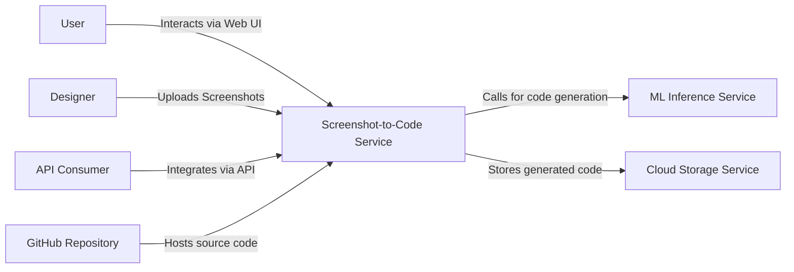
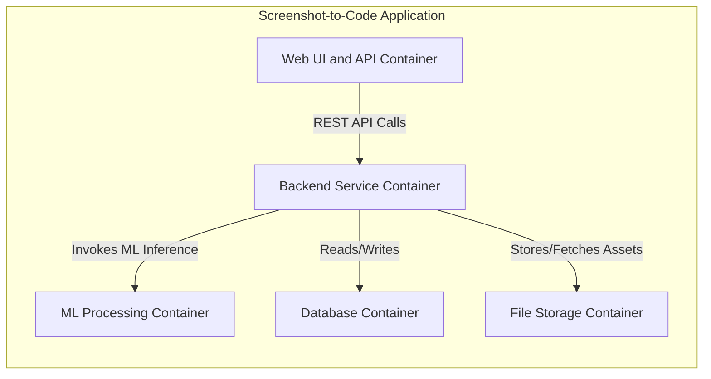
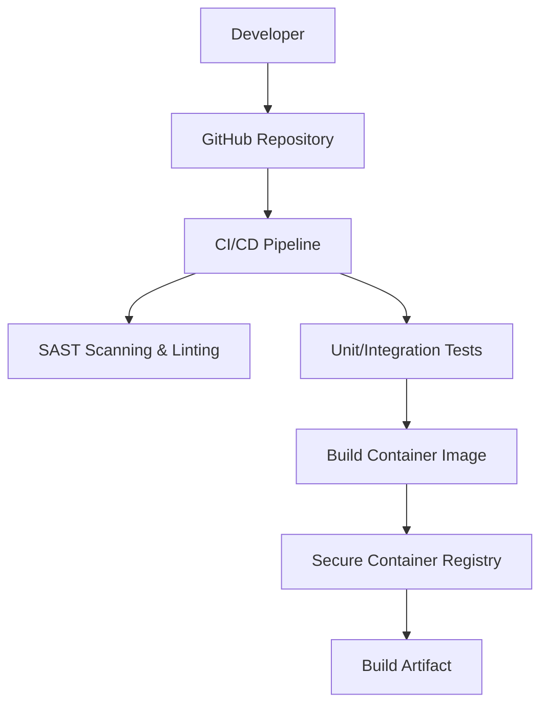

# BUSINESS POSTURE

This project aims to accelerate the design-to-development process by automatically converting screenshots into code. It is intended for rapid prototyping, helping designers and developers quickly iterate on UI ideas while potentially lowering the time-to-market for web and mobile application development. The project is currently open source but could be evolved into a SaaS offering or an integrated tool within existing design ecosystems. Business priorities include improving developer productivity, reducing manual coding effort in UI generation, and maintaining competitive differentiation through innovation in design automation.

Business Goals:
• Provide a reliable conversion from visual designs into code with a high degree of accuracy.
• Integrate seamlessly into existing design and development workflows.
• Evolve the tool into a commercially viable solution if adoption increases.

Business Risks:
• Poor conversion accuracy may result in reduced trust in the tool and increased manual rework.
• Exposure of proprietary design assets if screenshots contain sensitive intellectual property.
• Dependencies on third-party and open source libraries that might introduce vulnerabilities.
• Misuse or unauthorized replication of copyrighted design elements.

# SECURITY POSTURE

Existing security controls:
• security control: The project source code is managed in a GitHub repository with branch protection rules and enforced code reviews.
• security control: GitHub Actions (if configured) provide automated vulnerability scanning and SAST during pull requests.
• security control: Basic network security is provided by the hosting platform if deployed in a cloud environment.

Accepted risks:
• accepted risk: Dependency on open source libraries that may have undiscovered vulnerabilities is currently tolerated in this early stage.
• accepted risk: Limited logging and monitoring in the development stage is an acceptable risk until production hardening is performed.

Recommended security controls:
• security control: Integrate a comprehensive CI/CD security pipeline including SAST, DAST, and dependency vulnerability scanning.
• security control: Enforce strong authentication and authorization measures for any production or SaaS deployments, potentially using OAuth2 or similar mechanisms.
• security control: Validate and sanitize all user inputs such as image uploads to mitigate injection and file-based attacks.
• security control: Utilize TLS for all data in transit, and enable encryption for data at rest in both the database and file storage.
• security control: Implement API rate limiting and input size restrictions to guard against denial-of-service attacks.

Security requirements:
• authentication: Secure methods must be implemented for any user-facing components; consider multi-factor authentication if accounts are supported.
• authorization: Role-based access controls must restrict access to configuration management, deployment functions, and sensitive operations.
• input validation: All inputs—including image files—must be rigorously validated and sanitized to prevent exploits and injection attacks.
• cryptography: Enforce TLS for communication channels and ensure sensitive data (credentials, proprietary designs) is encrypted both in transit and at rest. These requirements should be enforced through standard practices, including hardened configurations on cloud services and defined secure coding guidelines.

# DESIGN

The design outlines the architecture and deployment strategy for the screenshot-to-code project. It covers system context, container breakdown, deployment architecture, and the build/publish process.

## C4 CONTEXT

Below is a context diagram showing the Screenshot-to-Code Service at the center and its interactions with users and external systems.



The following table describes the elements in the context diagram:

| Name                         | Type             | Description                                                       | Responsibilities                                                                            | Security controls                                                              |
|------------------------------|------------------|-------------------------------------------------------------------|---------------------------------------------------------------------------------------------|--------------------------------------------------------------------------------|
| Screenshot-to-Code Service   | System           | Main service processing screenshots to generate code              | Process image inputs, invoke ML service, generate and deliver code output                   | Encrypted communications, input validation, API rate limiting                |
| User                         | Actor            | End user interacting with the service via a web interface           | Provide input, view code outputs                                                             | Authentication and secure session management                                 |
| Designer                     | Actor            | UI/UX designer providing visual assets for conversion               | Upload screenshots, review generated code                                                  | Access control if integrated with user accounts                                |
| API Consumer                 | Actor/System     | External system or developer tool integrating conversion capabilities | Integrate via API for automated conversion workflows                                         | API keys, OAuth, and access logging                                            |
| ML Inference Service         | External Service | Service that performs machine learning inference on input screenshots | Run ML models to analyze screenshots and generate code                                     | API access controls, encrypted communication channels                        |
| Cloud Storage Service        | External System  | Cloud-based storage for persisting screenshots and generated code   | Manage storage and retrieval of image and code artifacts                                     | Data encryption at rest and in transit, access control policies                |
| GitHub Repository            | Repository       | Code repository hosting the project                                 | Version control, artifact management                                                         | Branch protection, 2FA enforcement, and repository access controls             |

## C4 CONTAINER

The container diagram decomposes the screenshot-to-code service into high-level components and shows how they interact with one another.



The following table describes the elements in the container diagram:

| Name                    | Type       | Description                                                             | Responsibilities                                                       | Security controls                                                           |
|-------------------------|------------|-------------------------------------------------------------------------|------------------------------------------------------------------------|-----------------------------------------------------------------------------|
| Web UI and API Container| Container  | Frontend component that provides the user interface and API endpoints   | Handle user interactions, validate input, and forward requests         | TLS termination, input sanitization, authentication/authorization checks    |
| Backend Service Container| Container | Core business logic component managing request orchestration            | Process API requests, coordinate ML processing, manage session state     | Input validation, secure API endpoints, audit logging                       |
| ML Processing Container | Container  | Container responsible for running ML inference on screenshots           | Execute ML models to convert screenshots into code                       | API key management, network isolation, secure communication                 |
| Database Container      | Container  | Persistent storage for metadata, user sessions, and conversion records  | Data persistence and retrieval                                           | Encryption at rest, access control, periodic backup and auditing            |
| File Storage Container  | Container  | Storage for uploaded screenshots and generated code artifacts           | Manage file storage and delivery                                         | Access control policies, encryption mechanisms, and virus scanning on uploads |

## DEPLOYMENT

The project can be deployed using a containerized microservices architecture in a cloud environment. One recommended solution is to deploy the service on a managed Kubernetes cluster (or similar container orchestration platform). The Ingress Controller will expose the service securely over HTTPS, while managed services will be used for the database and storage components.

Below is a deployment diagram visualizing this recommended architecture:

```mermaid
flowchart TD
    USER[User]
    INGRESS[Ingress Controller]
    APP_SERVICE[Application Service (Kubernetes Deployment)]
    MANAGED_DB[Managed Database Service]
    OBJECT_STORAGE[Cloud Object Storage]

    USER -->|HTTPS Request| INGRESS
    INGRESS -->|Routes Traffic| APP_SERVICE
    APP_SERVICE -->|Reads/Writes Data| MANAGED_DB
    APP_SERVICE -->|Stores Artifacts| OBJECT_STORAGE
```

The following table describes the elements in the deployment diagram:

| Name                  | Type                | Description                                                                         | Responsibilities                                                        | Security controls                                                           |
|-----------------------|---------------------|-------------------------------------------------------------------------------------|-------------------------------------------------------------------------|-----------------------------------------------------------------------------|
| Ingress Controller    | Network Component   | Frontend load balancer and TLS terminator for external traffic                      | Route external requests to the correct service endpoints and enforce TLS | TLS encryption, rate limiting, and optional WAF policies                     |
| Application Service   | Containerized Service | Kubernetes-managed service running the screenshot-to-code containers                 | Host application containers, manage service orchestration                | Container isolation, hardened base images, vulnerability scanning           |
| Managed Database      | Cloud Service       | Managed database service (e.g., AWS RDS, Google Cloud SQL) for persistent storage      | Provide reliable and scalable data persistence                          | Encryption at rest, network isolation, secured access credentials           |
| Cloud Object Storage  | Cloud Service       | Object storage for persisting static files such as uploaded screenshots and code artifacts | Efficient storage and retrieval of binary data                          | Encryption at rest, fine-grained access control policies                    |

## BUILD

The build process is automated through a CI/CD pipeline integrated with GitHub Actions. A commit to the repository triggers the pipeline, which runs static analysis, SAST scans, unit and integration tests. On successful validation, container images are built and pushed to a secure container registry. Build artifacts are stored and tagged for traceability.

Below is a diagram illustrating the build and publish workflow:



Key security controls in the build process include:
• Ensuring reproducible builds by pinning dependency versions.
• Running automated security tests (SAST, dependency scans, linters) to catch vulnerabilities early.
• Securing the container registry and build artifacts with proper access control and vulnerability scanning.

# RISK ASSESSMENT

Critical business processes to protect:
• The core conversion functionality that transforms screenshots into code, which is central to customer value.
• The ML inference process that processes potentially sensitive design assets.
• The integration points (APIs) that allow external systems to leverage the service.

Data to protect and their sensitivity:
• Uploaded screenshots may contain proprietary UI designs and sensitive intellectual property, representing high sensitivity.
• Generated code artifacts, while less sensitive, are still critical as they embody automated derivations from proprietary designs.
• Potential user account details (if a sign-in is provided) which would include PII, requiring high protection.
• Metadata and logs that could indicate system behavior and usage patterns, which need controlled access.

# QUESTIONS & ASSUMPTIONS

Questions:
• Does the service require user authentication and authorization, or is it entirely open-access?
• What is the expected user load and concurrency level for the service?
• Will the ML inference functionality be run in-house or depend on third-party APIs?
• Are there any legal or compliance considerations regarding the handling of proprietary design assets?
• What is the desired level of logging, monitoring, and alerting for production deployments?
• How critical is high availability versus cost optimization in the deployment architecture?

Assumptions:
• The service accepts user-uploaded screenshots which may contain sensitive or proprietary designs.
• The current implementation is in an early development phase with basic security measures; further hardening is planned for production readiness.
• The project is containerized and is expected to be deployed on a cloud platform with managed services for storage and data persistence.
• The GitHub repository and CI/CD pipeline form the foundation for code management, automated testing, and vulnerability scanning.
• Secure communication channels (e.g., TLS) will be used for all external interactions.
• The overall architecture is designed to be iteratively improved as the project scales and its threat model matures.
