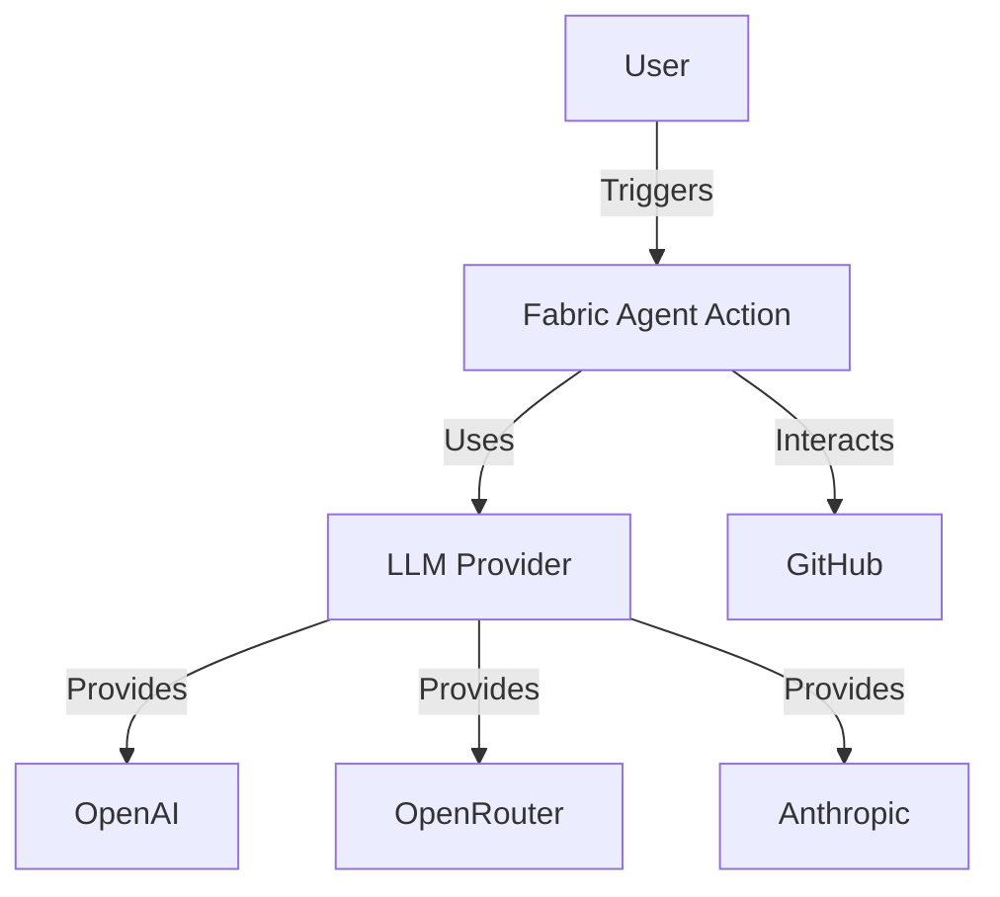
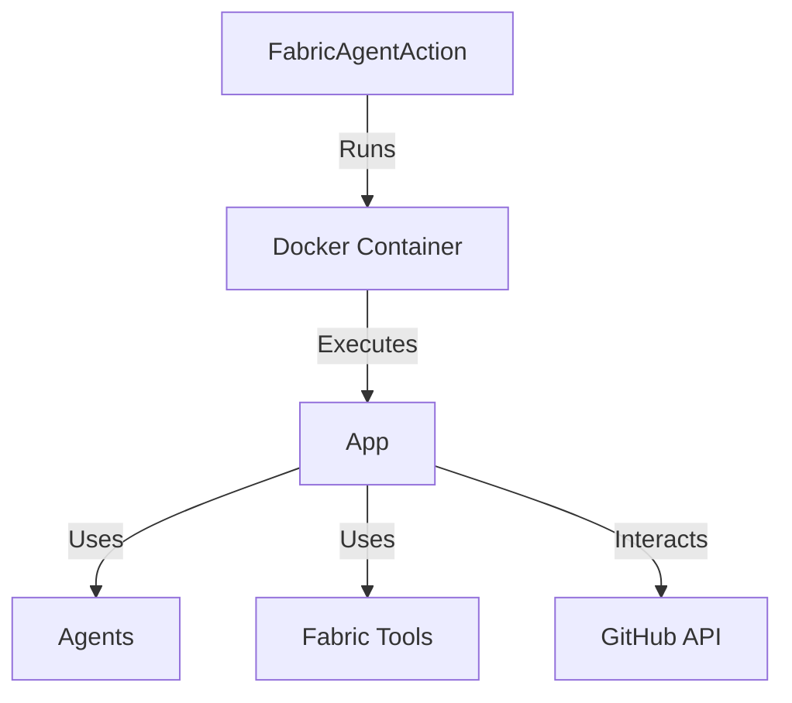
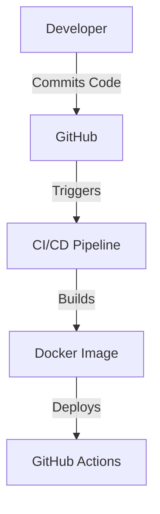
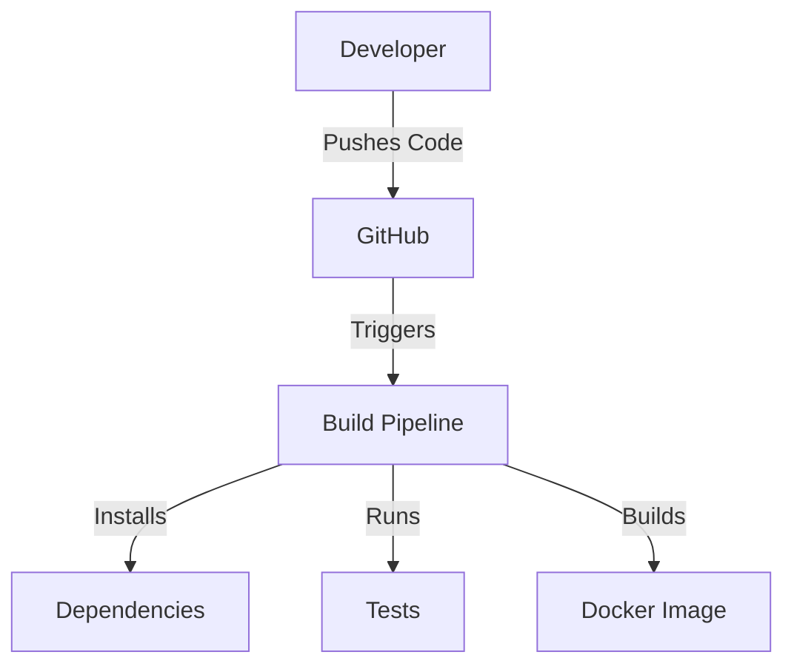

# Fabric Agent Action Design Document

## Business Posture

The Fabric Agent Action is designed to automate complex workflows using an agent-based approach, leveraging Fabric Patterns and Large Language Models (LLMs). The primary business goal is to provide seamless integration into existing workflows, allowing users to automate tasks with minimal setup. The action supports multiple LLM providers, offering flexibility and choice to users. Key business risks include unauthorized usage leading to increased API costs and potential misuse of the action in public repositories.

## Security Posture

### Existing Security Controls

- **Security Control**: Access control patterns are implemented to prevent unauthorized usage, as described in the README file. These include conditions for pull requests, issue comments, and general access control.
- **Security Control**: Environment variables for API keys are required, ensuring that sensitive information is not hardcoded.
- **Security Control**: The CI workflow includes security checks using Bandit to identify potential vulnerabilities in the codebase.

### Accepted Risks

- **Accepted Risk**: The action allows public repository comments to trigger workflows, which could be exploited if not properly controlled.

### Recommended Security Controls

- **Security Control**: Implement rate limiting to prevent abuse of the action in public repositories.
- **Security Control**: Add logging and monitoring to detect and respond to unauthorized access attempts.

### Security Requirements

- **Authentication**: Use GitHub secrets for storing API keys to authenticate with LLM providers.
- **Authorization**: Implement conditions in workflows to ensure only authorized users can trigger actions.
- **Input Validation**: Validate inputs to the action to prevent injection attacks.
- **Cryptography**: Use secure methods for handling and storing API keys and other sensitive data.

## Design

### C4 Context

| Name              | Type       | Description                                      | Responsibilities                          | Security Controls                                      |
|-------------------|------------|--------------------------------------------------|-------------------------------------------|--------------------------------------------------------|
| User              | Actor      | The user who triggers the GitHub Action          | Initiates workflows                       | N/A                                                    |
| FabricAgentAction | Component  | The GitHub Action leveraging Fabric Patterns     | Automates workflows using LLMs            | Access control patterns, environment variable usage    |
| LLMProvider       | Component  | Provides access to various LLMs                  | Supplies LLMs for pattern execution       | API key authentication                                 |
| GitHub            | System     | The platform hosting the repository and actions  | Hosts workflows and triggers actions      | GitHub secrets for API keys                            |
| OpenAI            | External   | LLM provider                                     | Provides LLM services                     | API key authentication                                 |
| OpenRouter        | External   | LLM provider                                     | Provides LLM services                     | API key authentication                                 |
| Anthropic         | External   | LLM provider                                     | Provides LLM services                     | API key authentication                                 |

### C4 Container

| Name            | Type       | Description                                      | Responsibilities                          | Security Controls                                      |
|-----------------|------------|--------------------------------------------------|-------------------------------------------|--------------------------------------------------------|
| DockerContainer | Container  | The container running the GitHub Action          | Isolates the execution environment        | Docker security best practices                         |
| App             | Component  | The main application logic                       | Executes workflows and interacts with LLMs| Input validation, logging                              |
| Agents          | Component  | Different types of agents for processing tasks   | Execute specific tasks using LLMs         | Input validation, error handling                       |
| FabricTools     | Component  | Manages and executes Fabric Patterns             | Provides pattern execution capabilities   | Input validation, error handling                       |
| GitHubAPI       | External   | GitHub API for interacting with repositories     | Fetches and updates repository data       | API key authentication                                 |

### Deployment

The Fabric Agent Action is deployed as a Docker container within GitHub Actions. It can be triggered by various GitHub events such as pushes, pull requests, and issue comments. The deployment process involves building the Docker image and pushing it to the GitHub Container Registry.

| Name           | Type       | Description                                      | Responsibilities                          | Security Controls                                      |
|----------------|------------|--------------------------------------------------|-------------------------------------------|--------------------------------------------------------|
| Developer      | Actor      | The developer who writes and commits code        | Initiates code changes                    | N/A                                                    |
| GitHub         | System     | The platform hosting the repository and actions  | Hosts code and triggers CI/CD pipelines   | GitHub secrets for API keys                            |
| CI/CD          | Process    | The continuous integration and deployment pipeline| Builds and tests code, deploys Docker image| Security checks, automated testing                     |
| DockerImage    | Artifact   | The Docker image containing the application      | Provides a consistent execution environment| Docker security best practices                         |
| GitHubActions  | System     | The platform executing the GitHub Action         | Runs the action in response to events     | Access control patterns, environment variable usage    |

### Build

The build process for the Fabric Agent Action involves using Poetry for dependency management and running a series of tests and linters to ensure code quality. The build is automated using GitHub Actions, which includes steps for installing dependencies, running tests, and building the Docker image.

## Risk Assessment

- **Critical Business Process**: Automating workflows using LLMs to improve efficiency and reduce manual effort.
- **Data Sensitivity**: API keys for LLM providers are sensitive and must be protected to prevent unauthorized access and potential misuse.

## Questions & Assumptions

- **Questions**:
  - How are API keys managed and rotated to ensure security?
  - What measures are in place to monitor and respond to unauthorized access attempts?

- **Assumptions**:
  - The action will primarily be used in private repositories where access control is more manageable.
  - Users will follow best practices for managing GitHub secrets and environment variables.
